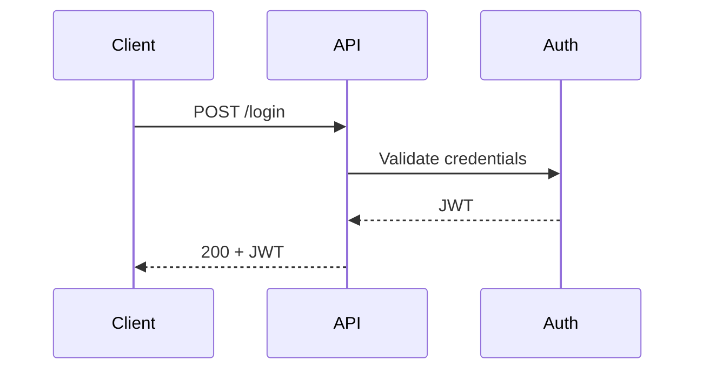

# Diagram Guidelines

Use diagrams sparingly to clarify non-obvious flows. Prefer diagrams only when text would be longer or less clear.

## When to Add a Diagram
- Multi-step flows (auth, data ingestion, async jobs).
- Architecture boundaries (services, modules, data stores).
- Non-trivial request or data lifecycles.

## When to Skip
- Single-module libraries with simple usage.
- Obvious flows already clear in text.
- Diagrams that would be screenshots or hand-drawn.

## Diagram Types

### System Context
- Shows external actors and system boundaries.
- Use for architecture docs or onboarding.

### Sequence
- Shows request/response ordering.
- Use for API call chains or auth flows.

### Component
- Shows modules and dependencies.
- Use for large codebases with clear domain boundaries.

## Formats
- Prefer Mermaid when the repo already uses Markdown.
- Keep diagrams text-based for diffability.
- Avoid PNGs unless they are already standard in the repo.

## Mermaid Conventions
- Keep labels short and consistent.
- Use title and direction for readability.
- Align with existing naming in code (module names, service names).

Example:

## Placement Rules
- README: include at most one small diagram.
- Architecture docs: diagrams can lead each section.
- API docs: prefer sequence diagrams for complex flows only.

## Maintenance
- Update diagrams when endpoints or module names change.
- Keep diagram source close to the section it explains.
