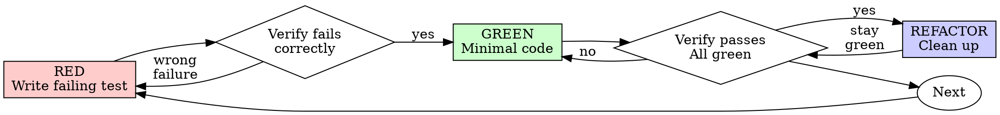

# Test-Driven Development (TDD)

## Overview

Write the test first. Watch it fail. Write minimal code to pass.

**Core principle:** If you did not watch the test fail, you do not know if it tests the right thing.

**Violating the letter of the rules is violating the spirit of the rules.**

## When to Use

**Always:**
- New features
- Bug fixes
- Refactoring
- Behavior changes

**Exceptions (ask your human partner):**
- Throwaway prototypes
- Generated code
- Configuration files

Thinking "skip TDD just this once"? Stop. That is rationalization.

## Language Quick Reference

Use your project test runner and naming conventions. These are examples only.

| Language | Common runner | Example command |
|---------|---------------|-----------------|
| JavaScript/TypeScript (React) | Jest or Vitest | `npm test -- path/to/test` or `pnpm vitest path/to/test` |
| Python | pytest | `pytest path/to/test_file.py -k test_name` |
| Go | go test | `go test ./path -run TestName` |

Pick the smallest test target that proves the behavior.

## The Iron Law

```
NO PRODUCTION CODE WITHOUT A FAILING TEST FIRST
```

Write code before the test? Delete it. Start over.

**No exceptions:**
- Do not keep it as "reference"
- Do not "adapt" it while writing tests
- Do not look at it
- Delete means delete

Implement fresh from tests. Period.

## Red-Green-Refactor



### RED - Write Failing Test

Write one minimal test showing what should happen.

<Good>
```text
test "retries failed operations 3 times":
    attempts = 0
    operation = function():
        attempts += 1
        if attempts < 3: raise error("fail")
        return "success"

    result = retry_operation(operation)

    assert result == "success"
    assert attempts == 3
```
Clear name, tests real behavior, one thing
</Good>

<Bad>
```text
test "retry works":
    mock = make_mock(fail, fail, success)
    retry_operation(mock)
    assert mock.called_times == 3
```
Vague name, tests mock not code
</Bad>

**Templates (pick your language):**

```typescript
it('does the thing', async () => {
  // arrange, act, assert
});
```

```python
def test_does_the_thing():
    # arrange, act, assert
    ...
```

```go
func TestDoesTheThing(t *testing.T) {
    // arrange, act, assert
}
```

**Requirements:**
- One behavior
- Clear name
- Real code (no mocks unless unavoidable)

### Verify RED - Watch It Fail

**MANDATORY. Never skip.**

```bash
<test-runner> <test-path>
```

Confirm:
- Test fails (not errors)
- Failure message is expected
- Fails because feature missing (not typos)

**Test passes?** You are testing existing behavior. Fix test.

**Test errors?** Fix error, re-run until it fails correctly.

### GREEN - Minimal Code

Write simplest code to pass the test.

<Good>
```text
function retry_operation(fn):
    for i in 0..2:
        try:
            return fn()
        except error:
            if i == 2: raise
    raise error("unreachable")
```
Just enough to pass
</Good>

<Bad>
```text
function retry_operation(fn, options = { max_retries, backoff, on_retry }):
    # YAGNI
```
Over-engineered
</Bad>

Do not add features, refactor other code, or improve beyond the test.

### Verify GREEN - Watch It Pass

**MANDATORY.**

```bash
<test-runner> <test-path>
```

Confirm:
- Test passes
- Other tests still pass
- Output pristine (no errors, warnings)

**Test fails?** Fix code, not test.

**Other tests fail?** Fix now.

### REFACTOR - Clean Up

After green only:
- Remove duplication
- Improve names
- Extract helpers

Keep tests green. Do not add behavior.

### Repeat

Next failing test for next feature.

## Good Tests

| Quality | Good | Bad |
|---------|------|-----|
| **Minimal** | One thing. "and" in name? Split it. | `test "validates email and domain and whitespace"` |
| **Clear** | Name describes behavior | `test "test1"` |
| **Shows intent** | Demonstrates desired API | Obscures what code should do |

## Why Order Matters

**"I will write tests after to verify it works"**

Tests written after code pass immediately. Passing immediately proves nothing:
- Might test wrong thing
- Might test implementation, not behavior
- Might miss edge cases you forgot
- You never saw it catch the bug

Test-first forces you to see the test fail, proving it actually tests something.

**"I already manually tested all the edge cases"**

Manual testing is ad-hoc. You think you tested everything but:
- No record of what you tested
- Cannot re-run when code changes
- Easy to forget cases under pressure
- "It worked when I tried it" does not equal comprehensive

Automated tests are systematic. They run the same way every time.

**"Deleting X hours of work is wasteful"**

Sunk cost fallacy. The time is already gone. Your choice now:
- Delete and rewrite with TDD (X more hours, high confidence)
- Keep it and add tests after (30 min, low confidence, likely bugs)

The "waste" is keeping code you cannot trust. Working code without real tests is technical debt.

**"TDD is dogmatic, being pragmatic means adapting"**

TDD is pragmatic:
- Finds bugs before commit (faster than debugging after)
- Prevents regressions (tests catch breaks immediately)
- Documents behavior (tests show how to use code)
- Enables refactoring (change freely, tests catch breaks)

"Pragmatic" shortcuts = debugging in production = slower.

**"Tests after achieve the same goals - it is spirit not ritual"**

No. Tests-after answer "What does this do?" Tests-first answer "What should this do?"
Tests-after are biased by your implementation. You test what you built, not what is required. You verify remembered edge cases, not discovered ones.

Tests-first force edge case discovery before implementing. Tests-after verify you remembered everything (you did not).

30 minutes of tests after does not equal TDD. You get coverage, lose proof tests work.

## Common Rationalizations

| Excuse | Reality |
|--------|---------|
| "Too simple to test" | Simple code breaks. Test takes 30 seconds. |
| "I will test after" | Tests passing immediately prove nothing. |
| "Tests after achieve same goals" | Tests-after = "what does this do?" Tests-first = "what should this do?" |
| "Already manually tested" | Ad-hoc does not equal systematic. No record, cannot re-run. |
| "Deleting X hours is wasteful" | Sunk cost fallacy. Keeping unverified code is technical debt. |
| "Keep as reference, write tests first" | You will adapt it. That is testing after. Delete means delete. |
| "Need to explore first" | Fine. Throw away exploration, start with TDD. |
| "Test hard = design unclear" | Listen to test. Hard to test = hard to use. |
| "TDD will slow me down" | TDD faster than debugging. Pragmatic = test-first. |
| "Manual test faster" | Manual does not prove edge cases. You will re-test every change. |
| "Existing code has no tests" | You are improving it. Add tests for existing code. |

## Red Flags - STOP and Start Over

- Code before test
- Test after implementation
- Test passes immediately
- Cannot explain why test failed
- Tests added "later"
- Rationalizing "just this once"
- "I already manually tested it"
- "Tests after achieve the same purpose"
- "It is about spirit not ritual"
- "Keep as reference" or "adapt existing code"
- "Already spent X hours, deleting is wasteful"
- "TDD is dogmatic, I am being pragmatic"
- "This is different because..."

**All of these mean: Delete code. Start over with TDD.**

## Example: Bug Fix

**Bug:** Empty email accepted

**RED**
```text
test "rejects empty email":
    result = submit_form({ email: "" })
    assert result.error == "Email required"
```

**Verify RED**
```text
FAIL: expected "Email required", got empty
```

**GREEN**
```text
function submit_form(data):
    if not trim(data.email):
        return { error: "Email required" }
    # ...
```

**Verify GREEN**
```text
PASS
```

**REFACTOR**
Extract validation for multiple fields if needed.

## Verification Checklist

Before marking work complete:

- [ ] Every new function or method has a test
- [ ] Watched each test fail before implementing
- [ ] Each test failed for expected reason (feature missing, not typo)
- [ ] Wrote minimal code to pass each test
- [ ] All tests pass
- [ ] Output pristine (no errors, warnings)
- [ ] Tests use real code (mocks only if unavoidable)
- [ ] Edge cases and errors covered

Cannot check all boxes? You skipped TDD. Start over.

## When Stuck

| Problem | Solution |
|---------|----------|
| Do not know how to test | Write wished-for API. Write assertion first. Ask your human partner. |
| Test too complicated | Design too complicated. Simplify interface. |
| Must mock everything | Code too coupled. Use dependency injection. |
| Test setup huge | Extract helpers. Still complex? Simplify design. |

## Debugging Integration

Bug found? Write failing test reproducing it. Follow TDD cycle. Test proves fix and prevents regression.

Never fix bugs without a test.

## Testing Anti-Patterns

When adding mocks or test utilities, read @testing-anti-patterns.md to avoid common pitfalls:
- Testing mock behavior instead of real behavior
- Adding test-only methods to production classes
- Mocking without understanding dependencies

## Final Rule

```
Production code -> test exists and failed first
Otherwise -> not TDD
```

No exceptions without your human partner's permission.
